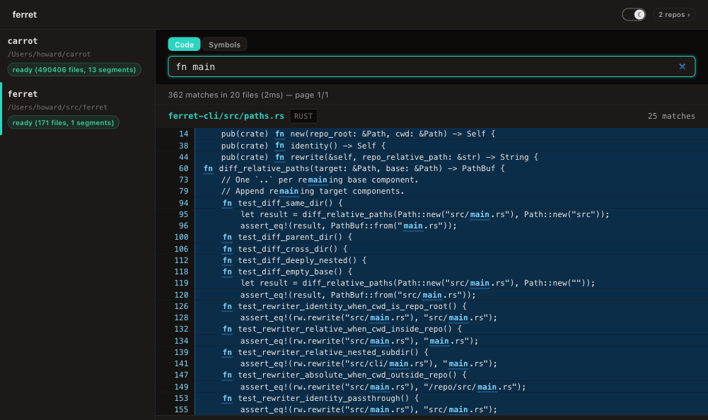
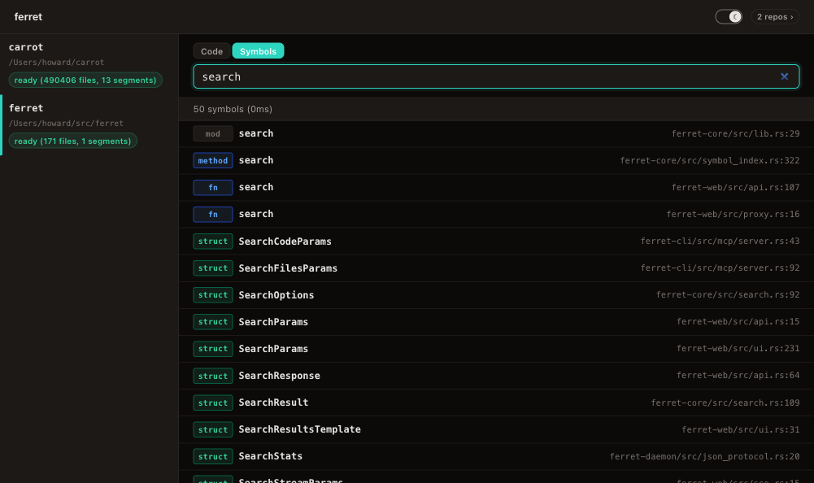
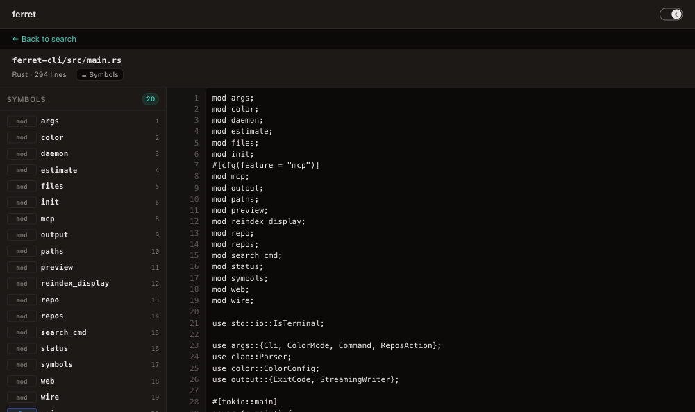
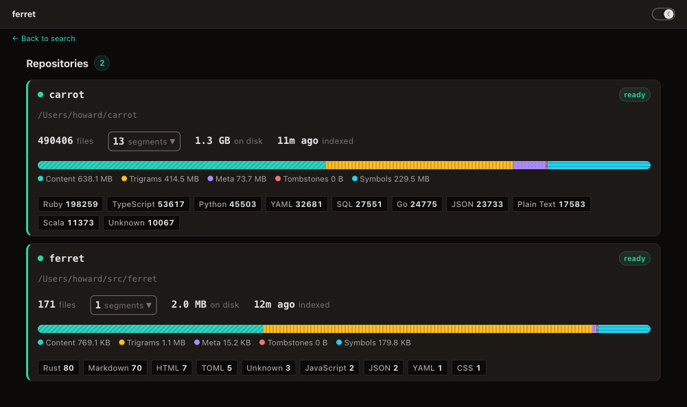
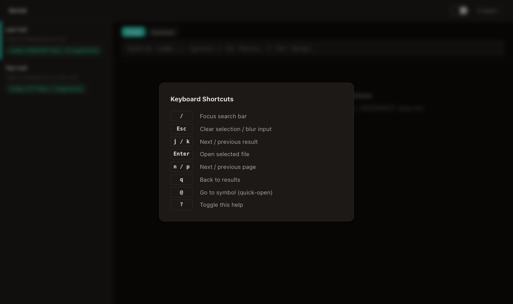

# ferret

Fast local code search using trigram indexing. Inspired by [Google Code Search](https://swtch.com/~rsc/regexp/regexp4.html) and [zoekt](https://github.com/sourcegraph/zoekt).

ferret builds a trigram index over source files, enabling substring search without scanning every file. Queries that would take seconds with `grep -r` return in milliseconds.

## How it works

Every 3-byte sequence (trigram) in each source file is recorded in a posting list. To search for `"parse"`, ferret extracts the trigrams `"par"`, `"ars"`, `"rse"`, looks up which files contain all three, then verifies the actual match in the narrowed candidate set.

The index is stored as immutable **segments** on disk. File changes are handled incrementally — modified files are tombstoned in old segments and re-indexed into new ones. Background compaction merges fragmented segments.

```
.ferret_index/segments/
  seg_0001/
    trigrams.bin     # Trigram posting lists (delta-varint encoded)
    meta.bin         # File metadata (58-byte fixed entries)
    paths.bin        # Path string pool
    content.zst      # Zstd-compressed file contents
    tombstones.bin   # Bitmap of deleted file IDs
```

## Quick start

```bash
# Build from source (inside this repo)
cargo install --path ferret-cli

# Index a repository (run from within the repo that you're indexing)
ferret init

# Search for a substring
ferret search "fn main"

# Search with the advanced query language
ferret search --query 'language:rust "fn main" NOT test'

# List indexed files
ferret files

# Show index status
ferret status
```

## Search modes

### Plain search (default)

Without `--query`, the search argument is treated as a plain substring. Flags control matching behavior:

```bash
ferret search "parseQuery"                  # Smart case (default): case-sensitive because of uppercase
ferret search "parsequery"                  # Smart case: case-insensitive (all lowercase)
ferret search -i "ParseQuery"              # Force case-insensitive
ferret search --case-sensitive "foo"        # Force case-sensitive
ferret search --regex 'fn\s+\w+'           # Regex mode
ferret search --language rust "struct"      # Filter by language
ferret search --path 'src/' "TODO"          # Filter by path
ferret search -C 3 "error"                 # Show 3 lines of context
ferret search -n 50 "import"               # Limit to 50 results
```

### Query language (`--query`)

The `--query` flag enables an advanced query language with boolean operators, filters, and pattern types inside a single expression.

```bash
ferret search --query '<query expression>'
```

`--query` is mutually exclusive with `--regex`, `--case-sensitive`, `--ignore-case`, `--smart-case`, `--language`, and `--path` — those features are expressed inside the query string instead.

### Query syntax

| Feature | Syntax | Example |
|---|---|---|
| Literal substring | bare word | `parse_query` |
| Exact phrase | `"quoted text"` | `"fn main"` |
| Regex | `/pattern/` | `/fn\s+\w+/` |
| Implicit AND | space-separated terms | `foo bar` (files containing both) |
| OR | `term1 OR term2` | `println OR eprintln` |
| NOT | `NOT term` | `NOT test` |
| Path filter | `path:prefix` | `path:src/core/` |
| Language filter | `language:name` or `lang:ext` | `language:rust`, `lang:py` |
| Case-sensitive | `case:yes term` | `case:yes FooBar` |

**Operator precedence:** NOT binds tightest, then AND (implicit), then OR. So `a b OR c d` parses as `(a AND b) OR (c AND d)`.

**Defaults:** Literals and phrases are case-insensitive. Regex patterns are case-sensitive. `case:yes` applies only to the immediately following term.

### Query examples

```bash
# Files containing both "Result" and "Error"
ferret search --query 'Result Error'

# Either println or eprintln in Rust files
ferret search --query 'language:rust println OR eprintln'

# Regex for function definitions, excluding test files
ferret search --query '/fn\s+\w+/ NOT test'

# Exact phrase in files under src/
ferret search --query 'path:src/ "fn main"'

# Case-sensitive match for a specific identifier
ferret search --query 'case:yes ParseError'

# Combine path and language filters
ferret search --query 'path:src/ lang:rs "pub fn"'

# Find TODO or FIXME comments in Python files
ferret search --query 'language:python TODO OR FIXME'

# Regex for import statements, excluding vendor directories
ferret search --query '/^import\s/ NOT path:vendor/'

# Match a struct definition but not its usage in tests
ferret search --query '"pub struct" NOT path:tests/'

# Multiple exclusions
ferret search --query 'language:rust async NOT test NOT example'
```

### Supported languages

Both full names and common extensions work (`language:rust` and `lang:rs` are equivalent):

`rust`, `python`, `typescript`, `javascript`, `go`, `c`, `cpp`, `java`, `ruby`, `shell`, `markdown`, `yaml`, `toml`, `json`, `xml`, `html`, `css`, `scss`, `sass`, `sql`, `protobuf`, `dockerfile`, `hcl`, `kotlin`, `swift`, `scala`, `elixir`, `erlang`, `haskell`, `ocaml`, `lua`, `perl`, `r`, `dart`, `zig`, `nix`, `plaintext`, `starlark`, `jsonnet`, `haml`, `csv`, `graphql`, `erb`, `template`, `restructuredtext`, `ejs`, `groovy`, `batch`, `csharp`, `vue`, `svelte`, `powershell`, `less`, `coffeescript`, `solidity`, `clojure`, `julia`, `assembly`, `nim`

## Web interface

ferret includes a browser-based search UI powered by [htmx](https://htmx.org/). Start it with:

```bash
ferret web              # default port 4040
ferret web --port 8080  # custom port
```

**Search-as-you-type** — results update live as you type, with match highlighting and file grouping:



**Symbol search** — toggle to Symbols mode to find functions, structs, traits, and enums across your codebase, color-coded by kind:



**File preview** — click any result to view the full file with a collapsible symbol outline panel for quick navigation:



**Repository dashboard** — see all registered repos at a glance with file counts, index size breakdown, segment details, and per-language file distribution:



**Keyboard-driven** — navigate entirely from the keyboard (`/` to focus, `j`/`k` to move, `Enter` to open, `@` for quick-open, `?` for help):



The web server is a stateless proxy — all search and file operations are forwarded to per-repo daemons over Unix sockets. It also exposes a JSON API at `/api/v1/` and SSE streaming endpoints for live search results and index status.

## Building

```bash
cargo build --workspace
```

## Testing

```bash
cargo test --workspace                          # All tests
cargo test -p ferret-indexer-core               # Core library only
cargo test -p ferret-indexer-core -- test_name  # Single test
cargo clippy --workspace -- -D warnings         # Lint
cargo fmt --all -- --check                      # Format check
```

## CLI commands

| Command | Description |
|---|---|
| `ferret init` | Build the index for the current repository |
| `ferret search <query>` | Search code (plain substring, regex, or query language) |
| `ferret files` | List indexed files with optional language/path filters |
| `ferret status` | Show index stats (segment count, file count) |
| `ferret reindex` | Incremental reindex (`--full` for complete rebuild) |
| `ferret estimate` | Estimate index size and peak RAM without building |
| `ferret repos` | Manage registered repositories (list, add, remove) |
| `ferret preview <file>` | Preview file contents with syntax highlighting |
| `ferret web` | Start the web interface (default port 4040) |
| `ferret mcp` | Run as an MCP server over stdio |

## Workspace crates

| Crate | Description |
|---|---|
| `ferret-core` | Library with all indexing, search, query parsing, and change detection logic |
| `ferret-cli` | CLI binary with daemon-backed search, file listing, index management, MCP server, and web interface |
| `ferret-daemon` | Daemon protocol library — TLV wire format, Unix socket client helpers, structured JSON response types |
| `ferret-web` | Web interface library — axum server, htmx frontend, JSON API, SSE streaming, daemon proxy |

## Architecture

### Indexing pipeline

```
files → trigram extraction → posting lists → delta-varint codec → binary format → disk segment
```

1. **Trigram extraction** — Slide a 3-byte window over file bytes
2. **Posting lists** — Map each trigram to the file IDs that contain it (positional byte offsets are optional, disabled by default for ~78% smaller indexes)
3. **Codec** — Delta-encode sorted IDs, then varint-compress (~4x smaller than raw u32 arrays)
4. **Segment write** — Serialize to `trigrams.bin` with a sorted trigram table for O(log n) lookup

### Search pipeline

```
query → parse → plan → trigram intersection → candidate verification → ranking
```

1. **Parse** query string into an AST (supports AND, OR, NOT, phrases, regex, path/language filters)
2. **Plan** the query: extract trigrams, estimate posting list sizes, choose smallest-first intersection order
3. **Intersect** posting lists via memory-mapped binary search on the trigram table
4. **Verify** candidates by decompressing content and matching (literal, regex, or case-insensitive)
5. **Rank** results by composite score: match type, path depth, filename match, match density, recency

### Incremental updates

- New/modified files go into a new segment
- Old entries are tombstoned (bitmap in `tombstones.bin`)
- Compaction merges segments, removing tombstoned entries
- Snapshot isolation via `Arc<Vec<Arc<Segment>>>` — readers never block writers

### Change detection

Three mechanisms feed changes into the segment manager:

- **File watcher** — `notify`-based filesystem events with 200ms debounce
- **Git diff** — Periodic `git` CLI calls to detect committed + unstaged + untracked changes
- **Hybrid detector** — Merges both sources into a deduplicated change stream

## Key design decisions

- **Byte-level trigrams** — Works on raw bytes, not characters. UTF-8 multi-byte sequences are handled naturally.
- **File-only posting lists** — By default, only file-level posting lists are stored (which file IDs contain each trigram). Positional byte-offset postings are optional and disabled in production, reducing index size by ~78% and peak build RAM by ~83%.
- **Size-budgeted segments** — `index_files_with_budget()` automatically splits large file sets into segments capped at 256 MB of raw content, keeping peak memory bounded.
- **Memory-mapped reads** — `trigrams.bin`, `meta.bin`, `paths.bin` are mmap'd via `memmap2`. The OS pages data in on demand.
- **Independent zstd compression** — Each file in `content.zst` is compressed independently (level 3), enabling random access without decompressing the whole store.
- **Atomic writes** — All writers use temp-file-then-rename for crash safety.
- **Magic numbers + versions** — Every binary file has a header for forward compatibility.

## Status

| Milestone | Status |
|---|---|
| M0: Types, CLI skeleton, CI | Complete |
| M1: Trigram indexing, posting lists, codec, search | Complete |
| M2: Directory walker, binary detection, file watcher, git change detection | Complete |
| M3: Segments, tombstones, multi-segment query, compaction, crash recovery | Complete |
| M4: Query parser, query planner, content verifier, relevance ranking | Complete |
| Web: Browser UI, JSON API, SSE streaming, daemon proxy | Complete |

## License

This project is not yet published under a specific license.
